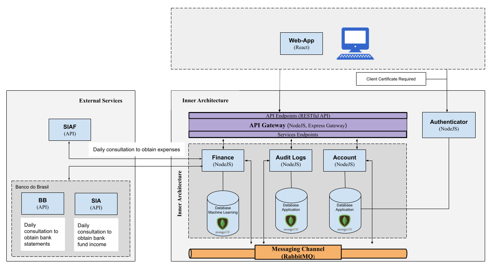

# Welcome !!

  
   

  Organization for the development of projects carried out in partnership between NUTES/UEPB and Sefaz/PB

  
  

<ul>
  <li><a href="https://docs.google.com/document/d/17VbOJp5Sssn2_9ZcvbiWBppS9zLwPRJuMDEGFz7sAXc">01 - Documento de Visão</li>  
  <li><a href="https://docs.google.com/document/d/1QM5WUwVEb8acC0RO-JWm9tL9Z4S0cveWcMwKPV0Vd30">02 - Documento de Controle de Acesso</li>  
  <li><a href="https://docs.google.com/document/d/1hvctT6ko6e8_j6vPglc5CEf5TCzH0SWkoHnjMUAKKmQ">03 - Documento de Requisitos</li>  
  <li><a href="https://docs.google.com/document/d/1jj7aKp7s4pVTubTgZGHYYQVKIu9I2LncHuPhMZnQgjE">04 - Documento de Arquitetura</li>    
  <li><a href="https://docs.google.com/document/d/1mrvJJcDq_Z0cikBITJGZ1CDHjMI6ZfsDx0Wa3lOsyCA">05 - Documento de Implantação</li>    
  <li><a href="https://docs.google.com/document/d/1zBEp1kV1ZgvLI2ReiK6lxWIc_Jpc4Q8uuFmgKkTpk6Q">06 - Manual do Usuário</li>    
</ul>

 Partnership: <a href="http://nutes.uepb.edu.br/">NUTES-UEPB</a> | <a href="https://www.sefaz.pb.gov.br/">SEFAZ-PB</a>

